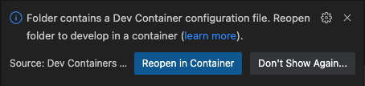

# Simple boilerplate for Python development with DevContainer

For more information about DevContainer, please see the official article below.

https://code.visualstudio.com/docs/devcontainers/containers

DevContainer confines the execution environment and libraries in a container to support development without polluting the host OS environment.

This repository is intended to be the simplest possible template for a DevContainer for Python development.

# How to use

NOTE: Please prepare necessary middleware such as Docker and VSCode extensions in advance.

1. Clone this repository.
2. Open the project in VSCode.
3. Click `Reopen in Container`.

  

4. After a short wait, a container is created and the project opens in the container.

# Other Use Cases

## Add extensions to be installed

Please add it to "extensions" in the `devcontainer.json` file. The name of the extension is the "Identifier" of the extension.

## Install some python libraries during docker build

Please add the necessary libraries to requirements.txt before you build (or `Reopen in Container`).

Using pipenv is not recommended here, as pipenv install during build will create the virtual environment deep in the container, making it impossible to install new libraries later.(At least when I tried it.)

Since the execution environment is confined to a container, it is acceptable to use pip in this case.
